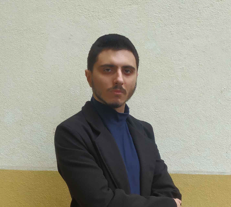

  
# PORTFÓLIO

## Pedro Henrique Siqueira Cardoso

## INTRODUÇÃO
Meu nome é Pedro Henrique Siqueira Cardoso, tenho 22 anos e estou no sexto semestre do curso de Análise e Desenvolvimento de Sistemas na FATEC São José dos Campos. Minha trajetória com programação começou cedo, quando eu tinha cerca de 11 ou 12 anos. Naquela época, meu interesse foi despertado enquanto jogava jogos em Flash e queria criar meus próprios, ou enquanto jogava Minecraft e desejava modificar o jogo. Também me intrigava entender como as coisas que eu fazia no computador funcionavam. No entanto, minha jornada na área começou formalmente em 2017, aos 15 anos, quando iniciei o Curso Técnico em Tecnologia da Informação pela UNIVAP, simultaneamente ao ensino médio, concluindo em 2019.

Desde o início, sempre tive interesse em trabalhos autônomos, atuando como freelancer desde 2018 até o presente — com períodos de maior e menor atividade. Em 2020, servi ao exército, e em 2021, me matriculei na FATEC com o objetivo de retornar à área em que já tinha experiência, buscando um desenvolvimento mais estruturado para alcançar maior estabilidade no futuro.

Ao longo desse tempo, me envolvi em uma série de projetos diversos: criei inúmeros websites para diferentes finalidades, realizei correções de código, desenvolvi extensões para o Chrome, ferramentas de conversão de arquivos, modificações para jogos, scripts Shell variados, e projetos de computação gráfica utilizando OpenGL e Vulkan. Além disso, participei de muitos projetos tanto no curso técnico quanto na faculdade. Também já trabalhei com testes de penetração e outras atividades que envolvem segurança da informação, sempre dentro dos limites da ética, utilizando ferramentas como o Black Arch Linux.

Sempre em busca de novas oportunidades, tanto formalmente na forma de um emprego fixo, tanto como freelancer.

Recém contratado para estágio através de concurso público para a Secretaria de Assuntos Jurídicos da prefeitura de São José dos Campos.

## CONTATOS

- [E-mail](mailto:pz020609@gmail.com)
- [Linkedin](https://www.linkedin.com/in/pedro-cardoso-6b93011b6/)
- [Github](https://github.com/PhscZ)
- [Website](http://phsc.rf.gd)

## PRINCIPAIS CONHECIMENTOS
#### Linguagens de programação
- C
- Rust
- Java
- C#
- PHP
- Python (+ diversas bibliotecas, como Pytorch, Pandas, Matplotlib, Scikit-learn, Flask e Django)
- JavaScript e TypeScript (+ diversas bibliotecas e frameworks, como Node.js e Vue.js)
- Shell

#### Banco de dados
- MySQL, SQLite, PostgreSQL, MariaDB
- MongoDB

#### Outros
- HTML e CSS
- Apache e NGINX
- Linux (Ubuntu, Debian, Arch e Gentoo)
- Diversas ferramentas do BlackArch Linux e Kali Linux
- Godot, Unity

#### Busco aprender/aplicar
- C++, Erlang e Elixir, Clojure, Kotlin, Go
- Redis, Cassandra, CouchDB

## PROJETOS

### 1º semestre (2022-2)
- Empresa: FATEC SJC, professores Jean e Egidio
- Problema: Falta de controle sobre ordem de serviços nos laboratórios e quase nenhuma automação mo processo de informação de equipamentos com mau funcionamento.
- [Github](https://github.com/TerramEtVeru/API_Suporte_Fatec)
- Solução: Desenvolvimento de um sistema web para controle de ordem de serviços para automatizar o processo de informação de equipamentos com mau funcionamento com sistema de login e cadastro de usuários, onde um administrador pode cadastrar salas e usuários, visualizar as salas, editar as salas, visualizar os usuários e visualizar tickets enviados pelos usuários sobre possíveis defeitos, com um sistema de criação do layout de sala com a numeração dos computadores totalmente adaptável e modificável de acordo com mudanças na sala. 

#### Tecnologias
- Python + Flask para o backend e execução do CRUD
- JavaScript para a customização das salas
- HTML + CSS para o frontend
- SQLite para o backend, como sistema de banco de dados

#### Minha contribuição à equipe
Fui um desenvolvedor, desenvolvi primariamente o sistema de layout de salas - totalmente sozinho - utilizando JavaScript. Mas também fiz a integração com o banco de dados SQLite com os dados enviados pelo frontend, utilizando Python com a biblioteca Flask, fiz o planejamento do banco de dados e a criação de tal e algumas telas do front-end como a inicial, a do report do problema e a lista de problemas reportados.

#### Hard Skills
- Python + Flask: Consigo ensinar
- JavaScript: Consigo ensinar
- HTML + CSS: Consigo ensinar
- SQLite: Consigo ensinar

#### Soft Skills
- Proatividade: Fui o membro da equipe que mais foi atrás de desenvolver os requisitos anteriormente mencionados, como o layout de sala, indo atrás dos colegas com dificuldade pois a maioria eram iniciantes com literalmente nenhuma experiência, ajudando eles com suas tarefas como em todas as telas do front-end menos na parte de gráficos.
- Pensamento crítico: Critiquei diversos pontos que acreditava não serem relevantes ao projeto que foram propostos por outros membros da equipe, um exemplo sendo a discussão se os cargos deveriam ser fixos ou algo que o usuário do software poderia escolher, gerando discussões necessárias para o desenvolvimento da aplicação.
- Empatia: Como a maioria da equipe era iniciante na área da programação, não tendo literalmente nenhuma experiência na área, fui atrás de ajudar diversos membros, passando meu conhecimento e guiando eles quanto a isso.
- Resiliência: Mesmo quando meus colegas perdiam as esperanças ou estavam perdidos em relação a aplicação, segui em frente e fiz mais que o necessário para entregar os resultados necessários.

### 2º semestre (2023-1)
- Empresa: FATEC SJC, professor Giuliano Bertoti
- Problema: Falta de gerenciamento de aulas de uma professora, e falta de informações relacionadas as tarefas, turmas, alunos e estatísticas relacionados a tais aulas.
- [Github](https://github.com/Equipe-FULLSTACK/API-2)
- Solução: Desenvolvimento de um sistema desktop com sistema de cadastro de aulas, tarefas, alunos e turmas, onde é possível cadastrar alunos em uma turma, uma tarefa para um ou vários alunos (também para todos os alunos de uma turma), também o cadastro de aulas relacionadas a uma turma em específico podendo modificar os alunos independente da turma (para casos raros e excessões), também uma página inicial com todas as informações relevantes no dia-a-dia, e uma área de estatísticas relacionadas aos dados selecionados, como uma tarefa ou uma turma, também uma tela com múltiplos temas a serem selecionados.

#### Tecnologias
- Java + Java Swing para o frontend e H2 SQL para o banco de dados.

#### Minha contribuição à equipe
Fui o PO, estive envolvido em todos os aspectos do software, criei o código base para a geração das telas do frontend e seus objetos, além de desenvolver a prototipação de todas as telas e mostrar elas para o cliente. Desenvolvi o sistema de cadastro de todos os campos, a integração entre as telas, a integração com as bibliotecas externas de calendário e gráficos, a integração com o banco de dados SQL h2 e o sistema de múltiplos estilos. Também apresentei o projeto para o professor.

#### Hard Skills
- Java: Consigo ensinar

#### Soft Skills
- Proatividade: Fui o membro da equipe que mais contribuiu para o projeto como mencionado anteriormente, também fui o membro da equipe que fez a comunicação com o cliente e as apresentações, acabei pegando a grande maioria das responsabilidades nesse API.
- Resiliência: O projeto acabou sendo consideravelmente grande em relação a linhas de código, e em um momento teve muitos bugs, mas acabei não desistindo e focando até o final para resolver os problemas, principalmente em relação a salas e seus alunos possuindo tarefas de uma forma adaptativa, também tive que refazer diversas partes do software múltiplas vezes, por bugs ou por não estarem de acordo com a preferência do cliente, exemplos sendo a tela inicial e de cadastro dos alunos, salas e tarefas.
- Gerenciamento de tempo: Assim como mencionado anteriormente, fui o membro que mais contribuiu código, acabei tendo que gerenciar muito bem meu tempo para poder entregar tudo, principalmente considerando que se eu não fizesse minha parte os outros membros não podiam trabalhar na deles. Isso acabou se mantendo por todas as sprints pois sempre tinha uma nova task para ser desenvolvida, também o fato da equipe ser apenas composta por 4 membros, todos nós tivemos que gerenciar bem nosso tempo.
- Criatividade: Como eu fui o membro que projetou todo o layout e tive que fazer os fundamentos do software, acabei pensando fora do comum na abordagem de alguns problemas, principalmente relacionados ao código interno, como na parte de integração com o banco de dados e principalmente em relação a bibliotecas externas que usamos para pequenas features, como a seleção de datas e a parte dos gráficos, pois existia uma grande falta de documentação para tais e muitas opções a serem utilizadas, acabei indo contra o que eu estava acostumado no design de muitas coisas, pois já tinha trabalhado com Java e Swing no passado.

### 3º semestre (2023-2)
- Empresa: Ionic Health
- Problema: Nenhuma forma de organização e planejamento digital para a equipe regulatória da Ionic Health, que trabalha com processos que possuem etapas, responsáveis (com seus cargos e permissões) e prazos, causando um gargalo e baixa eficiência.
- Desenvolver uma plataforma web que funcione tanto em um computador desktop e em mobile para a equipe regulatória e organizacional da Ionic, que possui processos com etapas, responsáveis e prazos. Também um sistema de permissões e cargos, anexos, envio de email e autenticação de dois fatores.
- [Github](https://github.com/Equipe-FULLSTACK/API-3)
- Solução: Desenvolvimento de um sistema web com sistema de login e gerenciamento de usuários, notificações, cadastro e gerenciamento de processos, tarefas/tasks/etapas, tudo podendo possuir responsáveis e prazos. Com um sistema de anexos, envio de emails e autenticação de dois fatores. Também foi desenvolvido um sistema de cargos e permissões.

#### Tecnologias
- React como frontend
- Node.js como backend
- JavaScript e TypeScript como linguagens de programação principais
- MySQL como sistema de banco de dados

#### Minha contribuição à equipe
Fui o PO, tive interação constante com o cliente, trabalhei junto com o Scrum Master para o gerenciamento das tasks das sprints e os requisitos funcionais, chegando até a ir na sede da empresa, e fiz as apresentações, também fiz a integração base do backend e todo o sistema base do backend, ambos tanto na parte de processos e suas tarefas, tanto em relação ao sistema de usuários e permissões e cargos. Fiz o sistema de arquivos e acabei fazendo o sistema de email.

#### Hard Skills
- React: Consigo fazer com ajuda
- Node.js: Consigo ensinar
- JavaScript e Typescript: Consigo ensinar
- MySQL: Consigo ensinar

#### Soft Skills
- Resiliência: Na primeira entrega, achávamos que estava tudo bem encaminhado, mas na segunda vimos que a visão do cliente era um tanto diferente da nossa, e tivemos que fazer muitas coisas e reestruturar quase tudo, exemplos sendo o sistema de relação de tarefas e processos que foi refeito 3 vezes, isso foi relativamente frustrante e trabalhoso de se lidar, também houve o dilema da falta de comunicação do cliente em diversos momentos, atrapalhando ainda mais o desenvolvimento, mas apesar de tudo acabamos conseguindo desenvolver o software. Além de membros que não fizeram suas entregas corretamente, logo outros tendo que as completar, exemplo sendo o sistema de email e autenticação de dois fatores.
- Proatividade: Fui o PO e logo acabei tendo que tomar a iniciativa de muitas coisas, indo atrás de fazer muitas coisas, como na primeira sprint onde faltavam muitas features que deviamos entregar e acabei desenvolvendo elas sozinho, além de ajudar diversos membros com suas tasks, como no sistema de email (que acabou não funcionando e teve que ser refeito) e no sistema de autenticação de dois fatores. Também fui atrás de comunicar com a empresa.
- Gerenciamento de tempo: Acabamos tendo que refazer muita coisa, e isso foi muito intenso em relação ao tempo de desenvolvimento, então tive que ser muito eficiente principalmente na terceira e quarta sprint, tive que reescrever algumas partes como o sistema de relação de tarefas e processos múltiplas vezes, mas de forma eficiente para conseguir fazer as entregas.

### 4º semestre (2024-1)
- Empresa: SIATT, Sistemas Integrados de Alto Teor Tecnológico na área de defesa e aeroespacial.
- Problema: A falta de um sistema próprio para o gerenciamento de reserva de salas de reunião, isso sendo feito através de programas de terceiros com documentação, comunicação e planejamento manuais.
- [Github](https://github.com/Equipe-FULLSTACK/API-4)
- Solução: Desenvolvimento de um sistema web para o gerenciamento de reserva de salas de reunião, possuindo múltiplos tipos de sala e tipos de reuniões, com sistema de login e cadastro de usuários, cadastro e gerenciamento de salas, reuniões e permissões/cargos, tudo relacionado a horários, possuindo um sistema de agendamento.

#### Tecnologias
- React como frontend
- Node.js como backend
- JavaScript e TypeScript como linguagens de programação principais
- MySQL como sistema de banco de dados

#### Minha contribuição à equipe
Fui um desenvolvedor, foi a API que menos tive impacto, acabei fazendo a integração base das rotas do backend, além do processamento de dados relacionados, mas isso acabou sendo uma task que envolvia múltiplas pessoas, também fiz a base fundamental da integração com o Zoom, mas que acabou também se tornando uma task que envolvia múltiplas pessoas. Também ajudei no planejamento e execução do banco de dados.

#### Hard Skills
- React: Consigo fazer com ajuda
- Node.js: Consigo ensinar
- JavaScript e Typescript: Consigo ensinar
- MySQL: Consigo ensinar

#### Soft Skills
- Criatividade: Tive que inventar muita coisa e "me virar" para resolver varios problemas relacionados a integração com o Zoom, pois ninguém sabia de nada relacionado a isso e a documentação muitas vezes não era clara, mas com experimentação e raciocínio acabou sendo resolvido o dilema.
- Flexibilidade: Acabei tendo que sair do que estou acostumado e de minhas preferencias, por não ter colaborado tanto como nas APIs anteriores, tendo que utilizar código com uma estrutura diferente, além de uma abordagem um tanto diferente, exemplos sendo as rotas do CRUD do backend, e todo o padrão do código.
- Trabalho em equipe: Acabei dependendo mais da minha equipe, além de membros que dependiam de mim, pois a maioria das tasks da sprint eram simples, mas trabalhosas e tinham de ser resolvidas por múltiplas pessoas.

### 5º semestre (2024-2)
- Empresa: Kersys, empresa de gestão florestal
- Problema: A incapacidade do acompanhamento de dados climáticos de um ponto específico para produtores rurais.
- [Github](https://github.com/Equipe-FULLSTACK/API-5)
- Solução: Desenvolvimento de um aplicativo mobile com sistema de cadastro de pontos, exibindo dados climáticos (temperatura, pluviometria e umidade) desses locais. Os dados são apresentados em tempo real mas possuem um histórico, visível por meio de gráficos. O sistema inclui notificações customizáveis caso algum valor de um ponto ultrapasse um limiar definido.

#### Tecnologias
- React native como frontend
- Node.js como backend
- JavaScript e TypeScript como linguagens de programação principais
- MongoDB como sistema de banco de dados

#### Minha contribuição à equipe
Fui o Product Owner (PO), sendo responsável pelas apresentações e a comunicação com o cliente. Além disso, também trabalhei no backend, focando principalmente nas integrações com APIs internas, como do Google Maps, API de dados climáticos da NASA e depois a Weather Forecast API da Open-Meteo.

#### Hard Skills
- React: Consigo fazer com ajuda
- Node.js: Consigo ensinar
- JavaScript e Typescript: Consigo ensinar
- MongoDB: Consigo ensinar

#### Soft Skills
- Trabalho em equipe: Acabamos definindo poucas tasks para essa API ao todo, mas todas eram grandes e dependiam de múltiplas pessoas trabalhando juntas. Por exemplo, as notificações e os gráficos exigiam a integração com APIs climáticas, enquanto o sistema de pontos dependia da API do Google Maps. A colaboração foi essencial para o sucesso.
- Gerenciamento de tempo: Lidamos com muitos projetos simultâneos neste semestre. A gestão de tempo para concluir todas as atividades propostas foi um desafio, especialmente porque muitos membros da equipe trabalhavam em horários diferentes. Isso exigiu que as reuniões fossem bem planejadas e eficientes.
- Adaptabilidade: Alteramos vários aspectos da aplicação ao longo das sprints, como a escolha das APIs, a estruturação do backend e ajustes baseados no feedback das apresentações.

### 6º semestre (2025-1)
- Empresa: Dom Rock
- Problema: A falta de informação para guiar pacientes e principalmente cuidadores de tais pacientes quanto a questões relacionadas à doença de Alzheimer.
- [Github](https://github.com/FATEC-FULLSTACK/API6)
- Solução: Desenvolvimento de uma plataforma para fazer perguntas para LLMs (Large Language Models) e para o treinamento de tais modelos com RLHF (Reinforcement Learning with Human Feedback) e RAG (Retrieval-Augmented Generation).

#### Tecnologias
- Vue.js como frontend.
- Python como backend, com diversas bibliotecas/frameworks, principalmente LangChain e FastAPI.
- MongoDB como sistema de banco de dados, tanto relacional quanto vetorial.

#### Minha contribuição à equipe
Minha função foi a de Product Owner (PO), sendo responsável pela comunicação com o cliente e pela apresentação do projeto a ele e a outros indivíduos relevantes, como o professor responsável pela seleção dos artigos utilizados para a elaboração do banco de dados empregado na execução do RAG no Parque Tecnológico. A comunicação, como um todo, foi mais extensa do que nas outras APIs, além de eu ter tido que interagir muito mais com o professor P2, como PO trabalhei na documentação (critérios, MVP, DOR, DOD, user stories e backlogs) e no mockup do projeto no Figma.
Além disso, auxiliei em todos os aspectos do software de forma leve inicialmente, pois o professor M2 havia informado que o PO e o SM não poderiam fazer commits não relacionados à documentação, embora pudéssemos ajudar trabalhando junto dos próprios desenvolvedores. Contribuí majoritariamente no backend, especialmente na primeira parte de integração com os modelos de IA e nas rotas. No entanto, o sistema acabou sendo refeito no final devido à adoção de streaming de dados. Também fiz o layout de algumas páginas no frontend.

#### Hard Skills
- Python: Consigo ensinar
- Vue.js: Consigo fazer com autonomia
- MongoDB: Consigo fazer com autonomia

#### Soft Skills
- Trabalho em equipe: Como fui o Product Owner (PO), tive que me comunicar bastante com a equipe de desenvolvimento sobre requisitos funcionais e não funcionais, além de dialogar com o Scrum Master (SM) sobre a documentação, que foi bem mais extensa do que nos outros semestres. Com isso, acabei interagindo muito socialmente e guiando a equipe de diversas formas, conhecendo um pouco sobre todos os aspectos do software e sempre comunicando as ideias da equipe ao cliente. Acredito que, de todos os semestres, este foi o que teve a divisão de tarefas mais bem distribuída e com menos problemas, graças a tudo o que foi mencionado.
- Proatividade: Como Product Owner (PO), acabei tendo que tomar a iniciativa em muitas situações, principalmente em relação à documentação, que foi particularmente importante neste projeto. Como a falta de documentação e de requisitos do cliente — além de diversos outros aspectos, como o acesso ao banco vetorial e as preferências estéticas do cliente — poderia facilmente se tornar um gargalo para a eficiência do desenvolvimento do software, busquei resolver esses problemas muito antes de eles terem a chance de ocorrer.
- Empatia: Tivemos alguns problemas emocionais em nossa equipe, e tentei ser o mais amigável possível com as pessoas que precisavam, para garantir a evolução do projeto.
